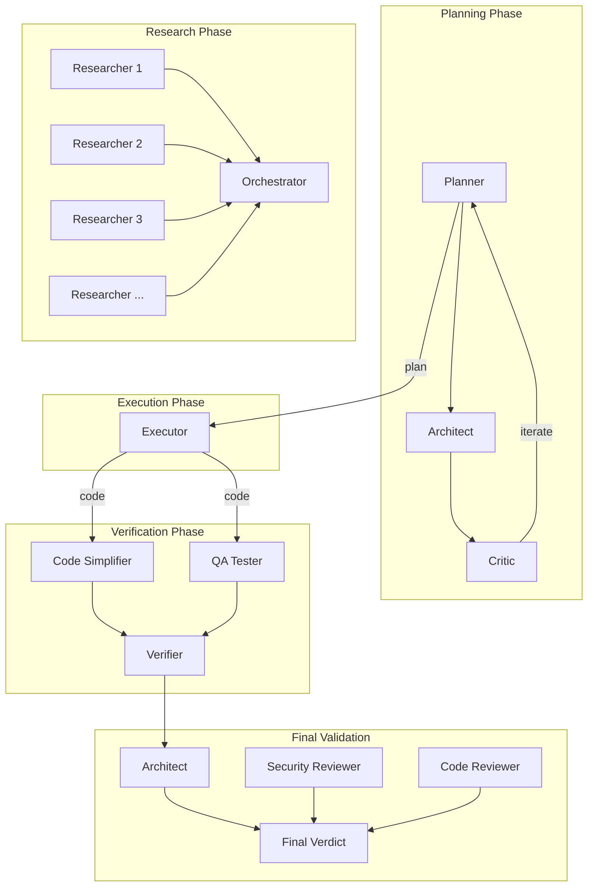

# Agents Reference

Agents are specialized subagents that perform specific roles within the pipeline. Each agent has a defined model, scope, and set of capabilities. Agents are invoked internally by skills and pipeline stages -- you rarely call them directly.

---

## How Agents Work

- Agents are delegated to by the orchestrator based on the task type
- Each agent has a **model** assignment (Opus for complex analysis, Sonnet for standard work, Haiku for quick lookups)
- Agents have a **level** that determines their autonomy and tool access
- The **executor** is the only agent that writes code -- all others are read-only advisors

---

## Core Agents

### executor

| Property | Value |
|----------|-------|
| **Model** | Sonnet |
| **Role** | Focused task executor for implementation work |
| **Level** | 2 |

The primary code-writing agent. All implementation work flows through executor. It receives a plan from the planner and produces working code. No other agent writes code during execution.

!!! important "The only code-writing agent"
    Although frontend-dev, backend-dev, and db-dev agents exist in the catalog, they are **not used** during pipeline execution. The executor handles all implementation to ensure consistent code style and avoid integration conflicts.

---

### planner

| Property | Value |
|----------|-------|
| **Model** | Opus |
| **Role** | Strategic planning consultant with interview workflow |
| **Level** | 4 |

Creates technical plans and task decompositions. Used during the ralplan consensus loop and for per-TODO planning in Phase 2. Conducts interviews when needed.

---

### architect

| Property | Value |
|----------|-------|
| **Model** | Opus |
| **Role** | Strategic architecture and debugging advisor (read-only) |
| **Level** | 3 |

Reviews plans and implementations for structural soundness, functional completeness, and architectural patterns. Read-only -- does not modify code. Used during ralplan consensus and final validation.

---

### critic

| Property | Value |
|----------|-------|
| **Model** | Opus |
| **Role** | Work plan and code review expert with multi-perspective analysis |
| **Level** | 3 |

Provides thorough, structured reviews of plans and code. Identifies gaps, risks, missing edge cases, and areas for improvement. Key participant in the ralplan consensus loop.

---

### analyst

| Property | Value |
|----------|-------|
| **Model** | Opus |
| **Role** | Pre-planning consultant for requirements analysis |
| **Level** | 3 |

Analyzes requirements before planning begins. Identifies ambiguities, dependencies, constraints, and potential issues in the user's request.

---

## Verification Agents

### verifier

| Property | Value |
|----------|-------|
| **Model** | Sonnet |
| **Role** | Verification strategy and evidence-based completion checks |
| **Level** | 3 |

Determines whether a task is truly complete by collecting and evaluating evidence. Checks test adequacy, requirement coverage, and overall quality.

---

### code-reviewer

| Property | Value |
|----------|-------|
| **Model** | Opus |
| **Role** | Expert code review with severity-rated feedback |
| **Level** | 3 |

Performs detailed code reviews covering logic defects, SOLID principles, performance, style, and quality strategy. Provides severity-rated feedback. Used during final validation.

---

### security-reviewer

| Property | Value |
|----------|-------|
| **Model** | Opus |
| **Role** | Security vulnerability detection specialist |
| **Level** | 3 |

Scans for OWASP Top 10 vulnerabilities, secrets exposure, unsafe patterns, and security anti-patterns. Used during final validation to ensure no security issues ship.

---

### code-simplifier

| Property | Value |
|----------|-------|
| **Model** | Opus |
| **Role** | Code simplification and refinement |
| **Level** | 3 |

Reviews code for unnecessary complexity, duplication, and over-abstraction. Simplifies while preserving all functionality. Runs in parallel with QA testing during per-TODO verification.

---

## Testing Agents

### qa-tester

| Property | Value |
|----------|-------|
| **Model** | Sonnet |
| **Role** | Interactive CLI and Playwright browser testing |
| **Level** | 3 |

Performs browser-based testing using Playwright. Executes tests from the checklist against the running application. Uses tmux for session management.

---

### test-engineer

| Property | Value |
|----------|-------|
| **Model** | Sonnet |
| **Role** | Test strategy, integration/e2e coverage, flaky test hardening |
| **Level** | 3 |

Designs test strategies, improves test coverage, and hardens flaky tests. Focuses on integration and end-to-end testing approaches. Used during checklist generation.

---

## Investigation Agents

### debugger

| Property | Value |
|----------|-------|
| **Model** | Sonnet |
| **Role** | Root-cause analysis, regression isolation, stack trace analysis |
| **Level** | 3 |

Diagnoses bugs through systematic root-cause analysis. Handles stack traces, build/compilation errors, and regression isolation. Central to the fix-bug workflow.

---

### tracer

| Property | Value |
|----------|-------|
| **Model** | Sonnet |
| **Role** | Evidence-driven causal tracing with competing hypotheses |
| **Level** | 3 |

Investigates issues by formulating competing hypotheses, gathering evidence for and against each, tracking uncertainty, and recommending next probes. Used by the trace and deep-dive skills.

---

## Research Agents

### researcher

| Property | Value |
|----------|-------|
| **Model** | Sonnet |
| **Role** | Read-only research for documentation, patterns, and best practices |
| **Level** | 2 |

Read-only research agent deployed in parallel during deep-research. Investigates specific topics and reports findings. 5-10 researchers run simultaneously for comprehensive coverage.

---

### explorer

| Property | Value |
|----------|-------|
| **Model** | Haiku |
| **Role** | Codebase search specialist |
| **Level** | 3 |

Lightweight agent for finding files and code patterns in the codebase. Uses Haiku for fast, low-cost searches.

---

### document-specialist

| Property | Value |
|----------|-------|
| **Model** | Sonnet |
| **Role** | External documentation and reference specialist |
| **Level** | 2 |

Looks up external documentation, APIs, and reference material. Used by external-context skill for web-based documentation searches.

---

### scientist

| Property | Value |
|----------|-------|
| **Model** | Sonnet |
| **Role** | Data analysis and research execution |
| **Level** | 3 |

Performs data analysis, statistical investigation, and research execution. Deployed in parallel by the sciomc skill.

---

## Design and Content Agents

### designer

| Property | Value |
|----------|-------|
| **Model** | Sonnet |
| **Role** | UI/UX designer-developer |
| **Level** | 2 |

Creates UI/UX designs, design tokens, and visual specifications. Used during the ui-specs pipeline stage.

---

### writer

| Property | Value |
|----------|-------|
| **Model** | Haiku |
| **Role** | Technical documentation writer |
| **Level** | 2 |

Writes README files, API documentation, and code comments. Uses Haiku for fast, cost-efficient documentation generation.

---

## Operations Agents

### git-master

| Property | Value |
|----------|-------|
| **Model** | Sonnet |
| **Role** | Git expert for atomic commits, rebasing, and history management |
| **Level** | 3 |

Handles git operations with style detection. Creates atomic commits, manages rebasing, and maintains clean git history.

---

## Specialist Agents (Not Used in Execution)

These agents exist in the catalog but are **not used** during pipeline execution. The executor agent handles all code writing.

### frontend-dev

| Property | Value |
|----------|-------|
| **Model** | Sonnet |
| **Role** | Frontend implementation specialist (React, CSS, components) |
| **Level** | 2 |

### backend-dev

| Property | Value |
|----------|-------|
| **Model** | Sonnet |
| **Role** | Backend implementation specialist (APIs, services, middleware) |
| **Level** | 2 |

### db-dev

| Property | Value |
|----------|-------|
| **Model** | Sonnet |
| **Role** | Database specialist (schema design, migrations, queries) |
| **Level** | 2 |

---

## Agent Model Summary

| Model | Agents | Use Case |
|-------|--------|----------|
| **Opus** | analyst, architect, planner, critic, code-reviewer, security-reviewer, code-simplifier | Complex analysis, architecture, deep review |
| **Sonnet** | executor, debugger, verifier, tracer, qa-tester, test-engineer, designer, researcher, document-specialist, scientist, git-master, frontend-dev, backend-dev, db-dev | Standard implementation, testing, research |
| **Haiku** | explorer, writer | Quick lookups, lightweight documentation |

---

## Agent Interaction Diagram

