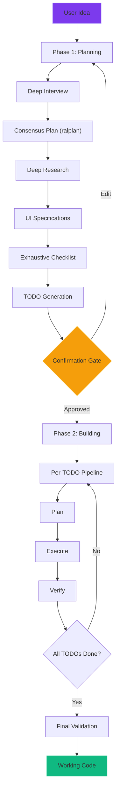

---
hide:
  - toc
---

# Aether OMCC

**Intelligent Multi-Agent Orchestration for Claude Code**

Aether OMCC is an extended fork of [oh-my-claudecode](https://github.com/nicobailon/oh-my-claudecode) (OMC) that adds a structured 2-phase pipeline, deep interview system, UI spec generation, exhaustive test checklists, auto-learning, Playwright-based QA, and more. It turns Claude Code into a full autonomous software engineering system.

---

<div class="grid cards" markdown>

- :material-rocket-launch:{ .lg .middle } **Full 2-Phase Pipeline**

    ---

    Plan everything first (interview, research, specs, TODOs), then build autonomously with per-TODO verification.

    [:octicons-arrow-right-24: Pipeline Architecture](pipeline.md)

- :material-account-group:{ .lg .middle } **20+ Specialized Agents**

    ---

    Architect, planner, executor, critic, security reviewer, QA tester, and more -- each with a defined role and model.

    [:octicons-arrow-right-24: Agents Reference](agents.md)

- :material-tools:{ .lg .middle } **40+ Skills**

    ---

    From full builds to bug fixes, deep research to idea capture -- invoke any workflow with a single slash command.

    [:octicons-arrow-right-24: Skills Reference](skills.md)

- :material-brain:{ .lg .middle } **Auto-Learning**

    ---

    Automatically extracts reusable skills from debugging sessions. The system gets smarter as you use it.

    [:octicons-arrow-right-24: Configuration](configuration.md)

- :material-test-tube:{ .lg .middle } **Playwright QA**

    ---

    Every TODO gets verified with Playwright browser testing. The exhaustive checklist covers every button, form, and interaction.

    [:octicons-arrow-right-24: Workflows](workflows.md)

- :material-chat-question:{ .lg .middle } **Deep Interview**

    ---

    Socratic Q&A with a 0% ambiguity threshold ensures nothing is left to assumption before planning begins.

    [:octicons-arrow-right-24: Getting Started](getting-started.md)

</div>

---

## Key Features

| Feature | Description |
|---------|-------------|
| **2-Phase Pipeline** | Plan everything, then build -- with a confirmation gate between phases |
| **Deep Interview** | Socratic multi-round Q&A reaching 0% ambiguity before planning |
| **Consensus Planning** | Planner, Architect, and Critic collaborate via ralplan |
| **Deep Research** | 5-10 parallel researcher agents investigate technologies and patterns |
| **UI Specifications** | Design tokens, per-page HTML specs, interactive gallery on port 8420 |
| **Exhaustive Checklist** | Project-wide test inventory covering every UI interaction |
| **Feature-Sized TODOs** | 8-15 tasks per project, each with Playwright verification criteria |
| **Auto-Learning** | Extracts reusable skills from debugging (threshold 85, max 3/session) |
| **Fix-Bug Pipeline** | Reproduce, diagnose, plan, execute, verify -- structured bug resolution |
| **Idea Capture** | `/table` stores enriched ideas in the background without stopping work |

---

## Quick Start

```bash
# Install the plugin
claude plugin marketplace add https://github.com/aether-auto/aether-omcc
claude plugin install aether-omcc@aether-omcc

# Run the full pipeline
/aether-omcc:build-all "your idea here"
```

[:octicons-arrow-right-24: Full installation guide](getting-started.md)

---

## Architecture Overview


