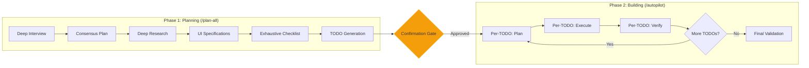
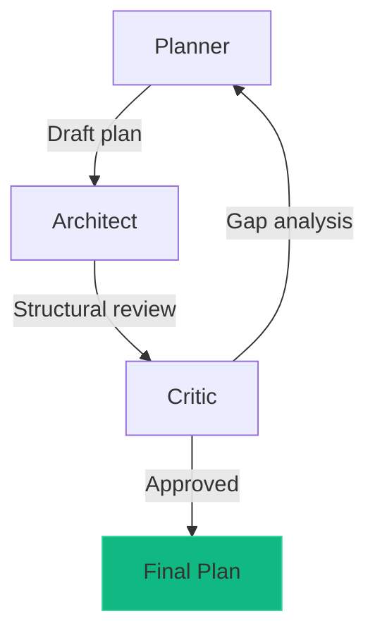
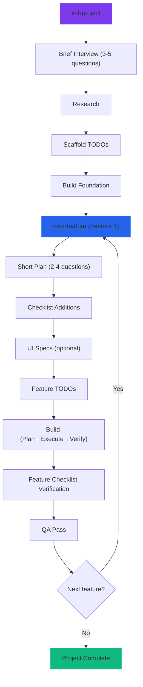

# Pipeline Architecture

Aether OMCC uses a structured 2-phase pipeline that separates **planning** from **building**. This ensures that all ambiguity is resolved, research is complete, and specifications are locked down before any code is written.

## Pipeline Overview

**Pipeline stage order:** `ralplan` -> `research` -> `ui-specs` -> `checklist` -> `todos` -> `execution` -> `ralph` -> `qa`

---

## Phase 1: Planning

Phase 1 is invoked with `/aether-omcc:plan-all` (or as the first half of `/aether-omcc:build-all`). It produces a complete specification before any code is written.

### 1. Deep Interview

**Skill:** `/aether-omcc:deep-interview`

The pipeline begins with a Socratic interview that systematically eliminates ambiguity from the user's request.

- **Multi-question rounds:** Each round presents 3-5 focused questions
- **Ambiguity scoring:** Mathematical calculation of remaining uncertainty
- **0% threshold:** The interview continues until all ambiguity is resolved
- **Structured output:** Produces a crystal-clear specification document

!!! info "How ambiguity is measured"
    The interview tracks ambiguity across multiple dimensions (scope, behavior, edge cases, integration points) and calculates a composite score. Each answered question reduces the score. The interview only proceeds to planning when the score hits 0%.

### 2. Consensus Planning (Ralplan)

**Skill:** `/aether-omcc:ralplan`

Once the interview is complete, the system generates a plan through multi-agent consensus:

1. **Planner** creates an initial technical plan
2. **Architect** reviews for structural soundness and completeness
3. **Critic** identifies gaps, risks, and missing considerations
4. The plan iterates until all three agents converge

### 3. Deep Research

**Skill:** `/aether-omcc:deep-research`

The research phase uses an orchestrator-worker pattern to investigate technologies, patterns, and best practices:

- **Smart detection:** Automatically identifies what needs research based on the plan
- **5-10 parallel researchers:** Read-only agents that investigate specific topics
- **Orchestrator synthesis:** Combines findings into actionable research artifacts
- **Evidence-based:** Each finding is grounded in documentation and examples

!!! tip "When research is skipped"
    If the plan uses only well-known, standard technologies, the research phase may determine that no deep investigation is needed and proceed directly to the next stage.

### 4. UI Specifications

**Skill:** `/aether-omcc:ui-specs`

For projects with user interfaces, the pipeline generates detailed visual specifications:

- **Design tokens:** Colors, spacing, typography, shadows, borders
- **Per-page specs:** HTML mockups for every page/view in the application
- **Interactive gallery:** Served on port 8420 for visual review
- **Component inventory:** Every UI component cataloged with states and variants

### 5. Exhaustive Test Checklist

**Skill:** `/aether-omcc:checklist`

Generates a project-wide test inventory that covers every testable interaction:

- Every button click and its expected outcome
- Every form submission with valid and invalid data
- Every page navigation and route transition
- Every component state and variant
- Edge cases, error states, and loading states

### 6. TODO Generation

**Skill:** `/aether-omcc:todos`

Breaks the plan into feature-sized implementation tasks:

- **8-15 TODOs per project** (right-sized for autonomous execution)
- Each TODO has clear acceptance criteria
- Each TODO includes Playwright verification steps
- Dependencies between TODOs are tracked
- TODOs are ordered for optimal execution sequence

---

## Confirmation Gate

After Phase 1 completes, the user reviews all generated artifacts:

- The plan document
- Research findings
- UI specifications (via the gallery)
- The test checklist
- The TODO list

The user can:

- **Approve** to proceed to Phase 2
- **Request edits** to refine any artifact
- **Cancel** to stop the pipeline

!!! warning "Gate is mandatory"
    The confirmation gate cannot be skipped. This is a deliberate design choice to keep humans in the loop before code generation begins.

---

## Phase 2: Building

Phase 2 is invoked with `/aether-omcc:autopilot` (or as the second half of `/aether-omcc:build-all`). It executes each TODO through a 3-step pipeline.

### Per-TODO Pipeline

Each TODO goes through:

#### 1. Plan

A fresh planner subagent with clean context creates an implementation plan for the specific TODO. This avoids context pollution from previous TODOs.

#### 2. Execute

The **executor** agent implements the TODO. This is the only code-writing agent in the system -- no specialist agents (frontend-dev, backend-dev, etc.) are used during execution.

!!! note "Why only executor?"
    Using a single executor agent ensures consistent code style, avoids integration conflicts between specialists, and simplifies the verification pipeline.

#### 3. Verify

Two verification passes run in parallel:

- **Code-simplifier:** Reviews the implementation for unnecessary complexity
- **QA-tester (Playwright):** Runs browser-based tests against the acceptance criteria

### QA Cycling

After each TODO's verification:

- If tests fail, the executor fixes the issues
- Build, lint, and test commands run until all pass
- The cycle repeats until the TODO is fully verified

### Final Validation

After all TODOs are complete, a comprehensive validation pass runs:

| Validator | Focus |
|-----------|-------|
| **Architect** | Functional completeness, structural integrity |
| **Security Reviewer** | Vulnerability scanning, OWASP Top 10 |
| **Code Reviewer** | Code quality, patterns, maintainability |
| **Checklist QA** | Playwright tests against the exhaustive checklist |

---

## Pipeline Stages Summary

| Stage | Skill | Agent(s) | Output |
|-------|-------|----------|--------|
| Interview | `deep-interview` | Planner | Specification document |
| Planning | `ralplan` | Planner, Architect, Critic | Technical plan |
| Research | `deep-research` | Researcher (x5-10) | Research artifacts |
| UI Specs | `ui-specs` | Designer | Design tokens, page specs, gallery |
| Checklist | `checklist` | Test Engineer | Test inventory |
| TODOs | `todos` | Planner | Implementation tasks |
| Execution | `autopilot` | Executor | Working code |
| Verification | (built-in) | Code-simplifier, QA-tester | Test results |
| Validation | (built-in) | Architect, Security, Code Reviewer | Final report |

---

## Alternative: Iterative Pipeline

For users who prefer feature-by-feature development over upfront planning:

The iterative pipeline differs from the 2-phase pipeline in that planning and building happen incrementally per feature, rather than all planning upfront followed by all building. The project checklist grows with each feature, maintaining a cumulative quality baseline.

| Stage | 2-Phase (`/build-all`) | Iterative (`/init-project` + `/next-feature`) |
|-------|----------------------|----------------------------------------------|
| Interview | Full deep interview (0% ambiguity) | Brief 3-5 questions + 2-4 per feature |
| Research | Full stack research | One-time stack research, reused |
| UI Specs | All pages upfront | Per-feature, optional |
| Checklist | Full project checklist | Incremental additions per feature |
| TODOs | All at once (8-15) | 1-3 per feature iteration |
| Building | All TODOs via autopilot | Per-feature with verification |
