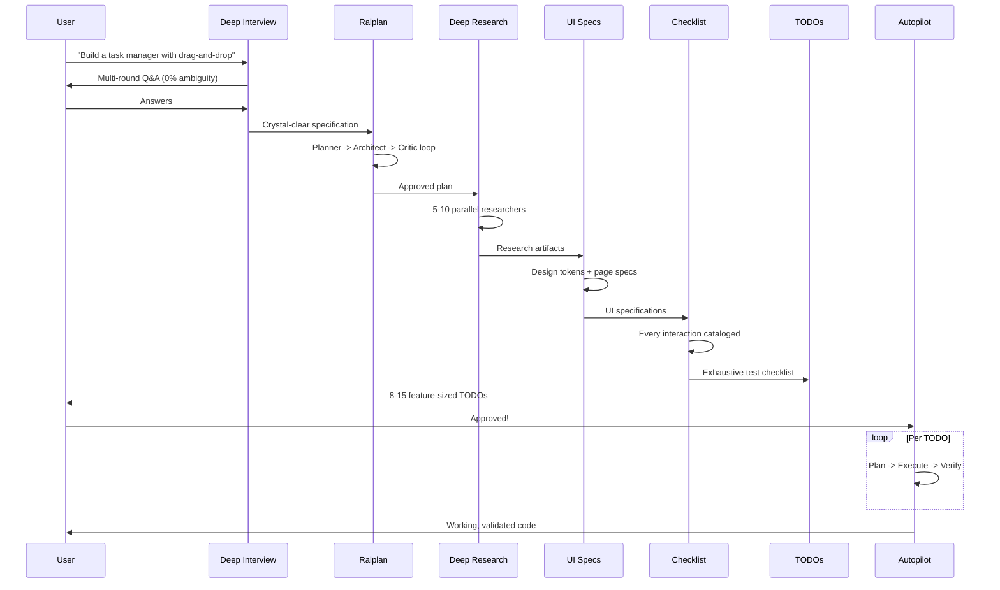
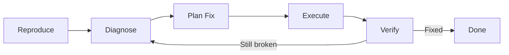
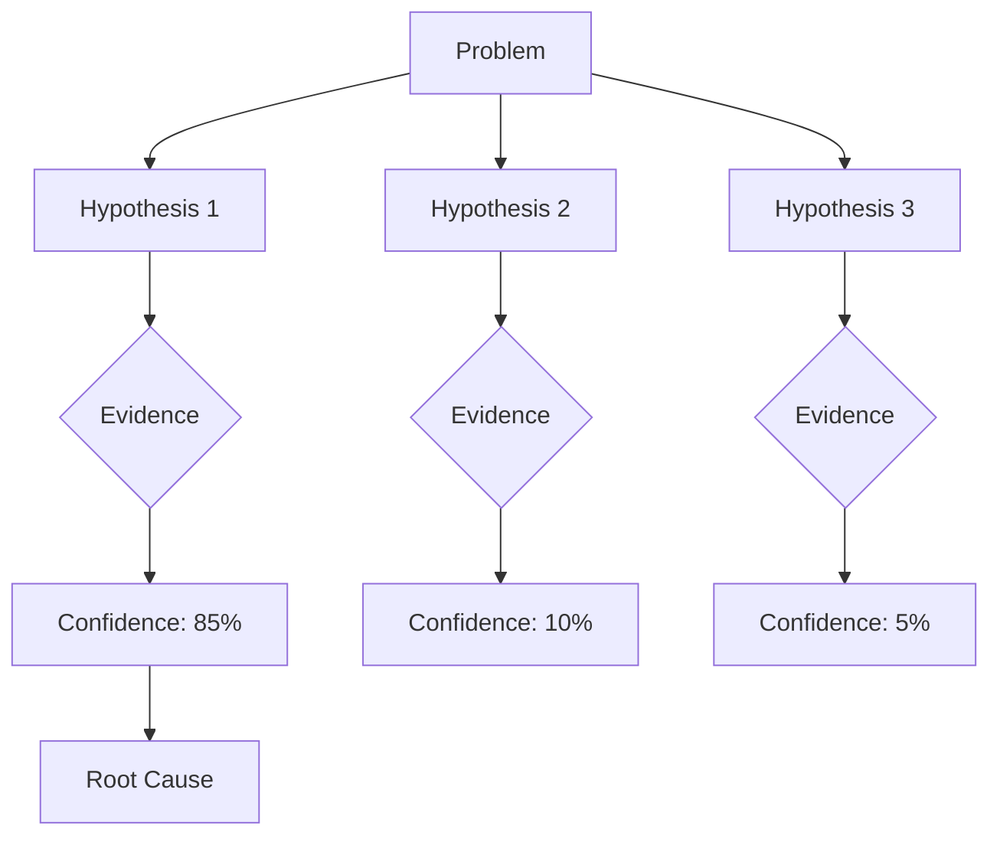
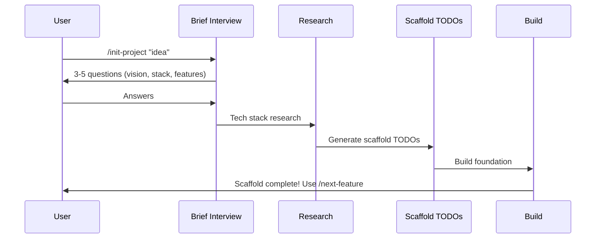
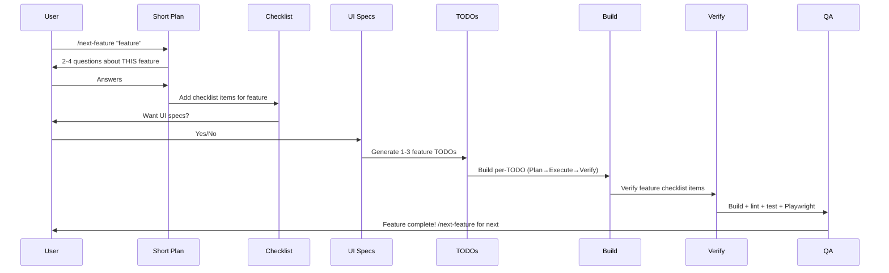

# Workflows

Step-by-step guides for the most common aether-omcc workflows.

---

## Full Build

**Command:** `/aether-omcc:build-all "your idea"`

The complete pipeline from idea to working code.

### Steps



1. **Start the pipeline** with your idea description (2-3 sentences is enough)
2. **Answer interview questions** -- the system asks multi-round questions until all ambiguity is eliminated
3. **Review the plan** -- consensus plan from Planner, Architect, and Critic
4. **Wait for research** -- parallel researchers investigate relevant technologies
5. **Review UI specs** -- browse the interactive gallery on port 8420
6. **Review checklist** -- exhaustive test inventory
7. **Review TODOs** -- 8-15 implementation tasks with acceptance criteria
8. **Approve at the gate** -- confirm to proceed to building
9. **Autonomous execution** -- each TODO is planned, executed, and verified
10. **Final validation** -- Architect, Security Reviewer, and Code Reviewer sign off

!!! tip "When to use"
    Use `build-all` for greenfield projects or major features where you want the full planning treatment. For smaller tasks, use `autopilot` directly.

---

## Planning Only

**Command:** `/aether-omcc:plan-all "your idea"`

Run the full planning phase without building.

### Steps

1. **Start planning** with your idea
2. **Complete the deep interview** (same as build-all)
3. **Review all artifacts:**
    - Specification document
    - Technical plan (from ralplan consensus)
    - Research findings
    - UI specifications and design tokens
    - Exhaustive test checklist
    - TODO list with acceptance criteria
4. **Iterate** -- request changes to any artifact
5. **Save** -- all artifacts are persisted in `.omc/plans/`

!!! tip "When to use"
    Use `plan-all` when you want to carefully review and iterate on the plan before committing to execution, or when you want to hand the plan to a human team.

---

## Bug Fixing

**Command:** `/aether-omcc:fix-bug "symptom description"`

Structured pipeline for diagnosing and fixing bugs.

### Steps



1. **Describe the symptom** -- what's going wrong?
2. **Reproduction** -- the system attempts to reproduce the bug
3. **Diagnosis** -- debugger agent performs root-cause analysis
4. **Plan** -- planner creates a targeted fix plan
5. **Execute** -- executor implements the fix
6. **Verify** -- Playwright tests + regression checks confirm the fix
7. **Loop** -- if verification fails, diagnosis restarts with new evidence

!!! example "Example"
    ```
    /aether-omcc:fix-bug "Users are seeing a blank screen after login on Safari"
    ```

---

## Quick Execution

**Command:** `/aether-omcc:autopilot "task"`

When you already know what to build and don't need the full planning phase.

### Steps

1. **Describe the task** clearly
2. **Requirements analysis** -- quick analysis of what's needed
3. **Technical design** -- executor plans the implementation
4. **Implementation** -- code is written
5. **QA cycling** -- build, lint, test until all pass
6. **Validation** -- multi-perspective review

!!! tip "When to use"
    Use `autopilot` for well-defined tasks, small features, or when you've already done planning separately with `plan-all`.

---

## Persistence Mode

**Command:** `/aether-omcc:ralph "task"`

**Trigger keyword:** `ralph`

For tasks that need guaranteed completion, regardless of how long they take.

### Steps

1. **Describe the task**
2. **Ralph loop begins** -- self-referential execution loop
3. **Work continues** until the task is verified complete
4. **Verification** -- configurable reviewer checks completion
5. **Loop** -- if not complete, work continues automatically

### Key Properties

- Will not stop until the task is done (or explicitly cancelled)
- Configurable verification reviewer
- Handles context window limits by maintaining state across iterations
- Cancel with `/aether-omcc:cancel`

!!! warning "Long-running"
    Ralph mode can run for extended periods. Make sure you have sufficient API credits and are comfortable with autonomous execution before starting.

---

## Idea Capture

**Command:** `/aether-omcc:table "idea"`

Store ideas during development without breaking your flow.

### Steps

1. **Table an idea** while working on something else
2. The system enriches the idea in the background
3. **Ideas are persisted** and can be retrieved later
4. **Resume later** -- pick up a tabled idea when you're ready

!!! example "Example"
    ```
    /aether-omcc:table "Add email notifications for overdue tasks"
    /aether-omcc:table "Consider adding a dark mode toggle"
    /aether-omcc:table "The onboarding flow could use a progress indicator"
    ```

---

## Auto-Learning

The system automatically extracts reusable skills from debugging sessions.

### How It Works

1. During a session, the system monitors debugging patterns
2. When a pattern crosses the **learning threshold** (score >= 85), extraction triggers
3. The **auto-writer** agent creates a reusable skill definition
4. Maximum **3 skills per session** to avoid noise
5. Extracted skills are saved and available in future sessions

### What Gets Learned

- Common debugging patterns and their resolutions
- Project-specific workflows that repeat
- Tool usage patterns that prove effective
- Error handling strategies

### Configuration

Auto-learning behavior can be configured in `.claude/settings.json`:

```json
{
  "omc": {
    "autoLearning": {
      "enabled": true,
      "threshold": 85,
      "maxPerSession": 3
    }
  }
}
```

See [Configuration](configuration.md) for all available settings.

---

## Multi-Agent Research

**Command:** `/aether-omcc:deep-research "topic"`

For thorough investigation of a technology, pattern, or approach.

### Steps

1. **Describe what to research**
2. **Smart detection** -- system identifies specific research questions
3. **Parallel deployment** -- 5-10 researcher agents investigate simultaneously
4. **Evidence collection** -- each researcher gathers documentation and examples
5. **Synthesis** -- orchestrator combines findings into actionable artifacts
6. **Output** -- research report saved to `.omc/research/`

!!! example "Example"
    ```
    /aether-omcc:deep-research "WebSocket scaling strategies for 100k concurrent connections"
    ```

---

## Evidence-Driven Tracing

**Command:** `/aether-omcc:trace "problem"`

**Trigger keyword:** `trace`

For complex debugging that needs systematic investigation.

### Steps

1. **Describe the problem**
2. **Hypothesis formation** -- tracer generates competing hypotheses
3. **Evidence gathering** -- each hypothesis gets evidence for and against
4. **Uncertainty tracking** -- confidence levels are maintained per hypothesis
5. **Probe recommendations** -- tracer suggests next investigative steps
6. **Convergence** -- most likely root cause is identified with evidence



---

## Iterative Feature-by-Feature

**Commands:** `/aether-omcc:init-project` then `/aether-omcc:next-feature`

Build incrementally — scaffold first, then add features one at a time.

### When to Use

- You want to see progress after each feature before planning the next
- Requirements may evolve as you build
- You prefer an exploratory, iterative approach over upfront planning

### Step 1: Initialize the Project

```bash
/aether-omcc:init-project "recipe sharing platform with search and user profiles"
```

This runs a **brief interview** (3-5 questions about vision, tech stack, main features), researches the stack, generates scaffold TODOs, and builds the foundation.



**Output:** Working project skeleton with base layout, auth (if needed), database setup, and a feature tracker.

### Step 2: Build Features One at a Time

```bash
/aether-omcc:next-feature "recipe search with filters and sorting"
```

Each `/next-feature` invocation:



1. **Short plan** — 2-4 focused questions (not full deep interview)
2. **Checklist additions** — Appends new test items (doesn't regenerate)
3. **UI specs** — Optional, reuses existing design tokens
4. **Feature TODOs** — 1-3 per feature, appended to existing TODOs
5. **Build** — Per-TODO 3-step pipeline (Plan → Execute → Verify)
6. **Verify** — Playwright tests feature's checklist items
7. **QA** — Build, lint, test, smoke test

### Step 3: Repeat

```bash
/aether-omcc:next-feature "user profiles with avatar upload"
/aether-omcc:next-feature "recipe ratings and reviews"
/aether-omcc:next-feature "admin dashboard with analytics"
```

Each feature builds on the previous ones. The checklist grows incrementally. The user controls the pace.

### Comparison with /build-all

| Aspect | `/build-all` | `/init-project` + `/next-feature` |
|--------|-------------|-----------------------------------|
| Planning | Exhaustive upfront | Brief scaffold + short per-feature |
| Building | All TODOs at once | One feature at a time |
| Checklist | Generated all at once | Grows incrementally |
| UI Specs | All pages upfront | Per-feature, optional |
| Best for | Clear requirements | Exploratory, evolving requirements |
| User involvement | Approve plan, then hands-off | Engaged between each feature |
